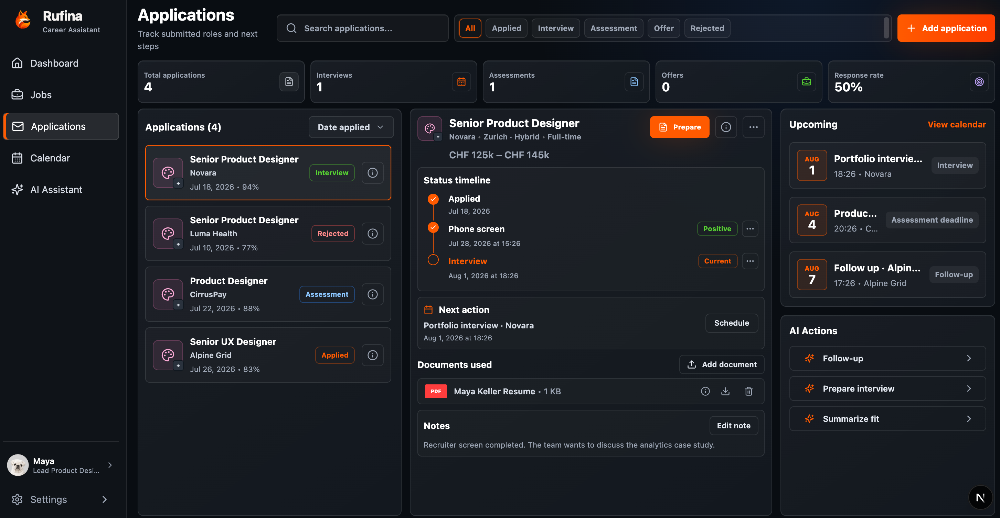
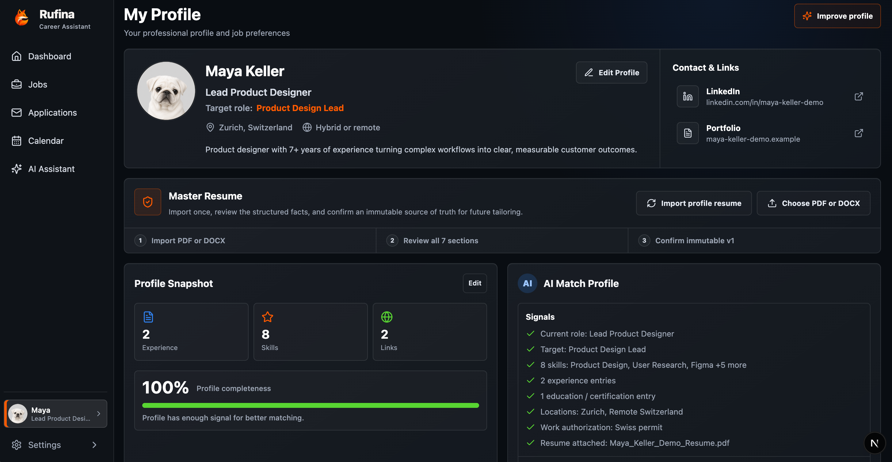

<h1 align="center">Personal AI Job Assistant</h1>

Rufina is a personal AI assistant for job hunting. It finds suitable job openings, assesses how well they match your profile, and tailors your resume and cover letters. The app also helps you store your documents and track the entire application process in one place.

## Key Features

 **Smart Job Search**: Automatically finds relevant opportunities on  LinkedIn,  Indeed, and other based on your preferences.

 **AI-Powered Matching**: Evaluates how well each vacancy matches your experience, skills, and career goals.

 **Tailored Resumes**: Adapts your resume to each position while keeping your professional background accurate.

 **Cover Letter Generation**: Creates personalized cover letters based on the vacancy, company, and your experience.

 **Application Tracking**: Keeps vacancies, documents, and application statuses organized in one workspace.

 **Candidate Profile**: Centralizes your professional experience, skills, and master resume.

 **Personal AI Assistant**: Supports you throughout the job search, from finding vacancies to preparing application documents.

## How It Works 

1.  **Build Your Candidate Profile**  
   Add your experience, skills, job preferences, and confirm your Master Resume.

2.  **Discover Relevant Vacancies**  
   Search opportunities across LinkedIn, Indeed, jobs.ch, and other supported sources.

3.  **Review Your AI Match**  
   See how each vacancy matches your profile, including strengths, gaps, and key requirements.

4.  **Prepare Your Application**  
   Confirm important details, tailor your CV, generate a cover letter, and complete the final review.

5.  **Track Your Progress**  
   Manage application statuses, next steps, interviews, assessments, and offers in one workspace.

## Getting Started